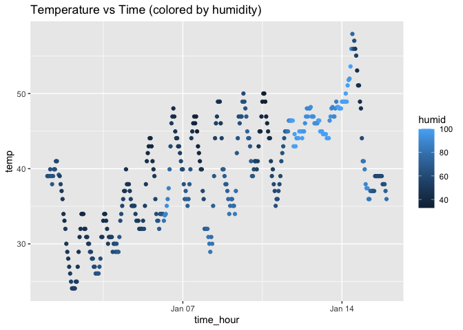

P8105 Homework 1
================
Shiyun Angel Cheng
2025-09-21

## Problem 1

``` r
# packages installed in consel and load library
library(moderndive)
library(ggplot2)
library(tidyverse)
```

    ## ── Attaching core tidyverse packages ──────────────────────── tidyverse 2.0.0 ──
    ## ✔ dplyr     1.1.4     ✔ readr     2.1.5
    ## ✔ forcats   1.0.0     ✔ stringr   1.5.1
    ## ✔ lubridate 1.9.4     ✔ tibble    3.3.0
    ## ✔ purrr     1.1.0     ✔ tidyr     1.3.1
    ## ── Conflicts ────────────────────────────────────────── tidyverse_conflicts() ──
    ## ✖ dplyr::filter() masks stats::filter()
    ## ✖ dplyr::lag()    masks stats::lag()
    ## ℹ Use the conflicted package (<http://conflicted.r-lib.org/>) to force all conflicts to become errors

``` r
#access to data
data("early_january_weather")
```

Describe the dataset using inline code

``` r
#check for variable names in the dataset 
names(early_january_weather)
```

    ##  [1] "origin"     "year"       "month"      "day"        "hour"      
    ##  [6] "temp"       "dewp"       "humid"      "wind_dir"   "wind_speed"
    ## [11] "wind_gust"  "precip"     "pressure"   "visib"      "time_hour"

The `early_january_weather` dataset contains the following variables:
origin, year, month, day, hour, temp, dewp, humid, wind_dir, wind_speed,
wind_gust, precip, pressure, visib, time_hour. Some important variables
include `temp` (temperature in Fahrenheit), `humid` (humidity level),
and `time_hour` (timestamp).

``` r
nrow(early_january_weather) #number of rows
```

    ## [1] 358

``` r
ncol(early_january_weather) #number of columns 
```

    ## [1] 15

``` r
mean(early_january_weather$temp, na.rm = TRUE) #average temperature
```

    ## [1] 39.58212

The dataset contains 358 observations and 15 variables. The average
temperature is 39.58.

Now we create a scatteplot.

``` r
ggplot(early_january_weather, aes(x = time_hour, y = temp, color = humid)) +
  geom_point() +
  labs(title = "Temperature vs Time (colored by humidity)")
```

<!-- -->
Export and Save plot

``` r
ggsave("temp_vs_time_plot.pdf")
```

    ## Saving 7 x 5 in image

## Problem 2

Create the dataframe

``` r
set.seed(1234) #for reproducibility

df = tibble(
  norm_sample = rnorm(10), #random sample of size 10 of a standard normal distribution 
  is_positive = rnorm(10) > 0, #logical vector indicating whether elements of the sample are greater than 0
  char_vec = letters[1:10], #character vector of length 10 
  factor_vec = factor(rep(c("low", "medium", "high", "low"), length.out = 10)) #factor vector of length 10, with 3 different factor levels 
)
```

Try takiing means

``` r
mean(df %>% pull(norm_sample))      # works: numeric
```

    ## [1] -0.3831574

``` r
mean(df %>% pull(is_positive))      # works: logical (TRUE = 1, FALSE = 0)
```

    ## [1] 0.3

``` r
mean(df %>% pull(char_vec))         # error: can't average characters
```

    ## Warning in mean.default(df %>% pull(char_vec)): argument is not numeric or
    ## logical: returning NA

    ## [1] NA

``` r
mean(df %>% pull(factor_vec))       # error: can't average factors
```

    ## Warning in mean.default(df %>% pull(factor_vec)): argument is not numeric or
    ## logical: returning NA

    ## [1] NA

When we try to take the mean of each varialbe, the numetric variable
works fine, and the logical variable also works find because R treated
True as 1 and False as 0. So taking the mean gives us the proportion of
the TRUEs. The character varable and factor variable do not work because
they are composed of letters and R cannot do math on them.

Now try turn them into numeric variables

``` r
as.numeric(df$is_positive)   # TRUE → 1, FALSE → 0
```

    ##  [1] 0 0 0 1 1 0 0 0 0 1

``` r
as.numeric(df$char_vec)      # NA with warning
```

    ## Warning: NAs introduced by coercion

    ##  [1] NA NA NA NA NA NA NA NA NA NA

``` r
as.numeric(df$factor_vec)    # Underlying integer levels
```

    ##  [1] 2 3 1 2 2 3 1 2 2 3

Converting logical to numeric works well (TRUE becomes 1, FALSE becomes
0). Converting character to numeric gives NAs, since letters can’t be
interpreted numerically. Factors convert to their underlying integer
levels — useful for some analyses but potentially misleading if labels
aren’t ordinal.

This helps explain what happens when we try to take the mean. It shows
taht only numeric or logival variables can be averaged directly, for
character and factor variables, we need to think before converting as
the as.numeric() command does not translate them directly into numeric
values.
